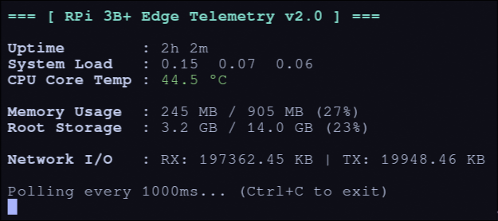

# rasmalaaiPiTelemetry

a small c++ script to keep an eye on my raspberry pi. it reads directly from `/proc` and `/sys` to show basic stats in the terminal. nothing fancy, just a quick way to check on things without installing bloated monitoring tools.

## project structure

* `v1/`: initial version using standard parsing.
* `v2/`: optimized version incorporating refined network parsing and VFS disk space monitoring.

it tracks:
- cpu temp (turns yellow if it gets over 70°c)
- ram usage
- system load & uptime
- network i/o (rx/tx on wlan0 or eth0)
- root storage space
```text
.
├── assets/
│   └── demo-output-v2.png    
├── config.ini
├── Makefile                 
├── README.md
├── v1/                     
│   ├── main.cpp
│   └── telemetry-monitor
└── v2/                    
    ├── main.cpp
    └── telemetry-monitor
```

## dashboard preview

<br>
*(visual representation of the rpi edge telemetry dashboard running in a standard terminal like kitty)*

## installation & how to run

no external dependencies needed. just compile and run it.

```bash
# clone this repo
git clone https://github.com/asitos/rasmalaaiPiTelemetry.git
cd ./rasmalaaiPiTelemetry

# build both versions at once
make

# give execution permissions to the binaries
chmod +x v1/telemetry-monitor v2/telemetry-monitor

# execute the optimized version
./v2/telemetry-monitor

# clean up build artifacts
make clean
```

it updates every second, press ctrl+c to exit

## configuration

you can customize the network interface monitored by the telemetry script by modifying the `config.ini` file in the root directory:

```ini
[Network]
interface = <option>
```

| \<option\>   | behaviour |
| ---        | ---       |
| wlan0/eth0 | monitors the specific interface name provided. |
| auto       | automatically detects and monitors the system's active default interface.|        
| *(empty)*  | defaults to auto |


## learning notes
- i learnt about optimisaton flags for gcc while compiling this for my rpi, and realised how there's different flags for each use case, O2, O3, Os, and march=native.

- since its a small sized system, i realised the -Os flag would be better to use, compared to the recommended -O2 flag for optimisation for space,takes insignificant extra time to compile, but requires less resources upon execution of the compiled program.

- later on, i also learnt how to develop a Makefile to automate the compilation process for my projects. learned how to define targets, manage dependencies, and use automatic variables like `$@` (target) and `$<` (first dependency) to streamline build commands.

- learning how implementing config.ini achieves dynamic options for the end user, for other host machines.

- further, before finishing up with the project, i looked up how naming conventions work for projects like these, so i renamed the folders and files to match the industry standard of naming conventions, and altered the makefile, directory structure accordingly.
